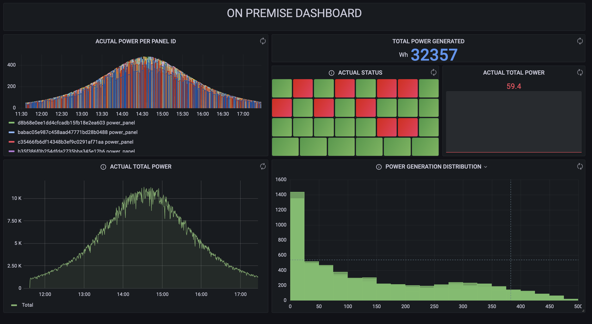

# DATA PROJECT 2


<p align="center">

</p>


<br>

## DESCRIPCIÓN

La empresa de placas solares **SolarMinds Technologies [^1]** ha decidido montar una infraestructura de gestión de los datos que cada placa individual genera para poder estimar la producción total de energía, así como monitorizar el estado de cada placa solar para facilitar las tareas de mantenimiento. En principio, dicha empresa tiene en su sede central montados y funcionados una serie de servidores que le gustaría utilizar para este proyecto. Nuestro objetivo como consultores es, primero facilitarles una herramienta E2E on premise que puedan usar para sacar la mayor cantidad de información valiosa posible pero, por otro lado, queremos enseñarles también las ventajas que supondría tener este software en el Cloud. 


<br>

## Equipo

- [Elyca Jardín](https://www.linkedin.com/in/elycajardin/): Máster en Ingeniería Marítima. Encargada de la parte de Business Inteligence y Data Analytics utlizando Grafana Cloud y Looker Data Studio

- [Pablo Martínez](https://github.com/Pablomartiver): Economista. Encargado de la parte de Data Engineering relativa a la cola de mensajes en Pub/Sub y Kafka (On premise)

- [Jorge Martínez](https://github.com/joorgemartinez): Licenciado en ADE. Parte del equipo de Data Engineering del proyecto. Desarrollo de código Python para Dataflow y Cloud Functions así como de Spark (On premise)

- [Miguel Moratilla](https://github.com/mimove): Doctor en Ing. Aeroespacial. Encargado Senior del proyecto. Responsable de la generación de los datos y la parte DevOps del proyecto. Diseño de la arquitectura, y dirección del proyecto distribuyendo tareas entre los componentes del equipo.

<br>

En este repositorio, se encuentra la solución On premise que hemos diseñado. Consta de las siguientes partes:

1. Generador de datos con envío a Kafka

2. Spark streaming para transformación de los mensajes

3. MySQL como almacenamiento

4. Grafana para visualización

5. Flask para generar una API de consulta de datos a la BD

Todo ello se encuentra dentro de un Docker compose. Para ejecutar el docker compose up hay que tener en cuenta 2 cosas:

1. Dentro del archivo de variables de entorno .env se puede configurar lo siguiente:

    ```s
    CONTAINERS=4 #Numero de paneles solares máximo a crear
    PROBABILIDAD=10 #Probabilidad de que un panel se apague
    TIME=5 #Delay entre datos de los paneles
    IMAGE=solar_gen_premise #Nombre de la imagen de docker de cada panel
    TOPIC=panelInfo #Nombre del topico en Kafka
    ```

2. Una vez configurado el archivo de variables de entorno, se puede ejecutar ```docker-compose up -d``` para activar la aplicación.


<br>

## Generador de datos (KAFKA)

Para simular el comportamiento de un placa solar, se ha optado por utilizar una ecuación basada en la secante hiperbólica, cuya distribución es muy similar a una distribución normal. La ecuación utilizada es:

$$\mathrm{P}=\frac{\mathrm{P_{max}}}{\cosh((t-t_{ini})*C-t_{ini})^{C}}$$


Donde $\mathrm{P_{max}}$ es la potencia máxima del panel, $t_{ini}$ la hora a la que empieza a generar energía, y $C$ es una constante que se utiliza para modificar el ancho de la curva.

La siguiente figura muestra como se vería la curva para una placa solar que produjera durante una hora, con un máximo de potencia de 400W:

<p align="center">

</p>


Con esta ecuación, el generador de datos lo que simula es una serie de contenedores Docker, siendo cada contenedor una placa solar individual, que tiene una probabilidad dada cada n segundos de estar produciendo energía o no.

Estos contenedores, envían información a un tópico de los brokers de Kafka. En total, está configuración cuenta con 2 Brokers para estar diseñada con tolerancia a fallos. Si uno de los 2 brokers se apaga, el otro sigue funcionando y la aplicación no daría ningún fallo.

<br>

## SPARK

Dentro de la carpeta de pyspark, se encuentra el código Python escrito utilizando la librería Spark Streaming para consumir los datos generados por los paneles solares mediante una subscripción al tópico de Kafka. En Spark se realizan los siguientes pasos:

1. Primero se leen los mensajes escritos en formato JSON que se encuentran en el tópico, creando un Dataframe con el contenido de los mensajes.

2. Los datos recibidos se guardan en una tabla de MySQL  que tiene el siguiente schema:

    ```sql
    CREATE TABLE IF NOT EXISTS panelData (
    Panel_id varchar(250) NOT NULL,
    power_panel DECIMAL(20,3) NOT NULL,
    current_status INT NOT NULL,
    time_data TIMESTAMP
    );
    ```


3. Se calcula una ventana para sacar en franjas de 30 segundos la potencia media generada por los paneles, y se escribe el resultado de la transformación en otra tabla de MySQL.

Una diferencia importante con respecto a la arquitectura de Cloud, es que Spark streaming no es 100% en streaming, si no que funciona mediante la creación de microbatches que luegos son volcados con la clase ```writeStream``` a la base de datos


Para ejecutar este código se puede hacer de 2 formas:

1. Ejecutando el siguiente comando desde la terminal:

    ```sh
    docker exec dataproject2_onpremise-spark-master-1 \
                /spark/bin/spark-submit \
                --master spark://spark-master:7077 \
                --jars /opt/spark-apps/mysql-connector-java-8.0.13.jar \
                --packages org.apache.spark:spark-sql-kafka-0-10_2.12:3.0.2 \
                --driver-memory 1G \
                --executor-memory 1G \
                --conf "spark.worker.instances=2" \
                /opt/spark-apps/main.py
    ```

2. Ejecutando el script ./run.sh que se encuentra dentro de la carpeta


<br>

## API EN FLASK

Se ha construido una API en Flask que, mediante una consulta con un ID concreto de una placa, devuelve todos los registros de esa placa en concreto para poder trabajar con ellos desde otra aplicación. En la siguiente imagen se ve un ejemplo de la llamada a la API:


<p align="center">

</p>


<br>

## GRAFANA CLOUD

En la parte de visualización, se ha creado un dashboard que se muestra en la siguiente imagen para un ejemplo con 30 placas solares:


<p align="center">

</p>


<br>

[^1]: Logo y nombre creados con la inteligencia artificial [Dall·E 2](https://openai.com/dall-e-2/) y ChatGPT respectivamente.